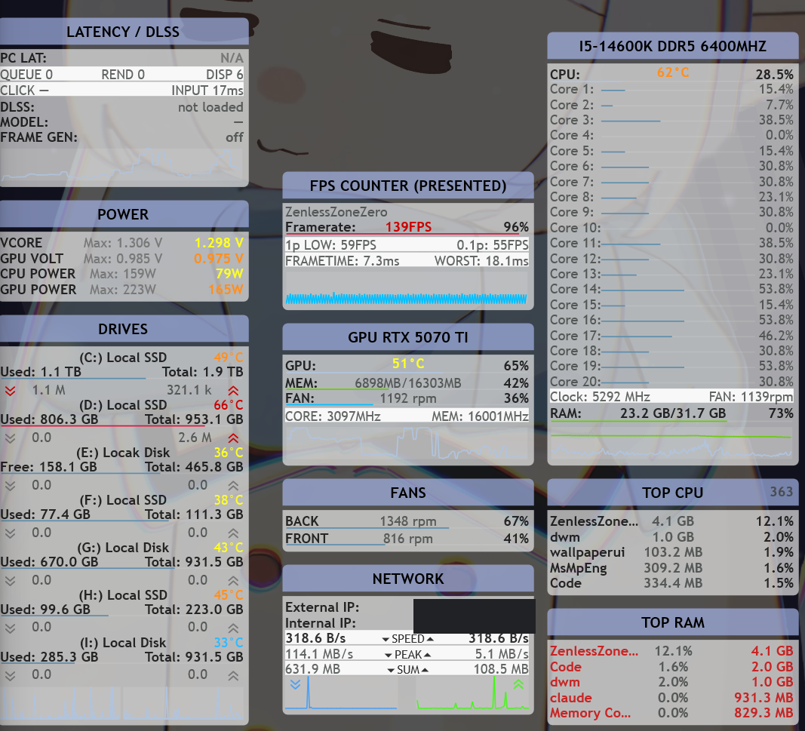

<div align="center">

# Halo

**Hardware Analytics & Live Overlay — a live hardware dashboard drawn directly on the Windows desktop.**

Windows 10 1809+ · Windows 11 · 64-bit · notification area

</div>

A native Windows 11 desktop widget suite that renders a live hardware dashboard directly on the desktop — CPU, GPU, RAM, drives, fans, power, network, latency, and a real-time FPS/frametime counter. Built to replace **Rainmeter + Rainformer + HWiNFO + MSI Afterburner + RTSS + the NVIDIA App** with one self-contained, low-overhead app, that does not inject anything into games.

<div align="center">

</div>

## What Halo does

- **Shows the whole machine at a glance** — Temperatures, loads, clocks, memory, fan speeds, power
  draw, drive activity and network throughput, each in its own widget.
- **Responsive FPS counter on 60hz** — The FPS counter reads frame timings through
  Intel PresentMon and ETW, so it can show both what the game submitted and what the monitor
  actually displayed, including 1% and 0.1% lows and frame generation.
- **Shows game latency and DLSS** — For games that include NVIDIA Reflex, Halo shows the PC latency
  breakdown, along with which DLSS features are active.
- **Customizable Widgets** — Each widget can be dragged to any monitor, snapped to screen
  and widget edges, set to stay on the desktop or above other windows, made click-through, or made
  partly transparent etc.
- **Minimal & Lightweight** — On the 20-thread machine Halo was built on, it uses under half a percent of
  total CPU on an idle desktop and about 2% while an uncapped game runs
  ([measurements](docs/perf-usage-breakdown.md)).

## Widgets

Eleven widget types are available, and any of them can be added more than once:

| Widget | Shows |
| --- | --- |
| **CPU / RAM** | Package temperature, per-core load, clock speed, RAM usage and a history graph |
| **GPU** | Temperature, load, VRAM, fan, core and memory clocks, and a history graph |
| **FPS counter** | Presented or displayed frame rate, 1% and 0.1% lows, average and worst frametime, and a live frame graph |
| **Latency / DLSS** | PC latency and its queue, render and display parts, click and input latency, and DLSS model and frame generation state |
| **Drives** | Temperature, used and total space, and read and write graphs for each drive |
| **Power** | CPU and GPU power draw and voltage |
| **Fans** | The speed of every fan the motherboard reports, with a nickname for each channel |
| **Network** | Download and upload speed, peak speed, total downloaded, and internal and external IP addresses |
| **Top processes — CPU** and **— RAM** | The busiest processes by CPU or by memory |
| **Clock** | Time, date and system uptime |

Rows, labels, colours, warning thresholds, graph history, refresh rate, monitor, z-order,
click-through and opacity can all be set per widget.

## Requirements

| Requirement | Needed for | Without it |
| --- | --- | --- |
| **Windows 10 1809 or later, or Windows 11, 64-bit** | Everything | The installer does not run |
| **Administrator approval once, at install** | Letting the sensor reader start at sign-in without a prompt | — |
| **PawnIO driver** (offered by the installer) | CPU temperature, clock speed, power and voltage, fan speeds, drive temperatures | Those rows show `N/A`; everything else works |
| **NVIDIA GPU and driver** | The full GPU widget, DLSS detection and Reflex latency | AMD and Intel GPUs show what LibreHardwareMonitor can read; latency and DLSS show `N/A` |

Nothing else needs to be installed. The download includes its own .NET runtime, so there is no
separate .NET, Visual C++ runtime, HWiNFO or Rainmeter to install. The installer is about 56 MB and
takes about 175 MB once installed.

## Install

### Installer

1. Download `Halo-Setup-<version>.exe` from [Releases](https://github.com/finaea/halo/releases/latest).
2. Open the downloaded file and approve the single UAC prompt.
3. SmartScreen may appear because Halo is not code signed. **More info → Run anyway** allows the
   installer to open.
4. Choose the optional parts. Both are selected by default:
   - **PawnIO driver for CPU temps, fans, drive temps** — A signed third-party kernel driver
     ([namazso/PawnIO](https://github.com/namazso/PawnIO)) that LibreHardwareMonitor uses to read
     those sensors. If the installer says a restart is needed, those rows show `N/A` until Windows
     restarts. This option does not appear when PawnIO is already installed, for example by
     FanControl, HWiNFO or LibreHardwareMonitor, and the existing driver is used instead.
   - **Start with Windows** — Starts Halo at every sign-in without asking for administrator
     approval again.
   - A **Create a desktop shortcut** checkbox is also available.
5. When setup finishes, the widgets appear and Settings opens on **System check**. It shows what
   the hardware reports, which data sources are working, and offers to arrange a starting layout
   on the monitors it finds.

### Portable

`Halo-<version>-win-x64.zip` from the same release unzips to a folder that keeps its settings and
logs in a `data` folder beside the programs. To start it, run `Halo.Collector.exe` as
administrator, then `Halo.Widgets.exe`. The portable copy adds nothing to Windows unless
**Turn on autostart…** is used in System check.

### Default Storage Location

| Item | Location |
| --- | --- |
| Program | `C:\Program Files\Halo` |
| Settings, layouts and logs | `%LOCALAPPDATA%\Halo` (or the `data` folder in the portable copy) |
| Start with Windows | Two scheduled tasks, `\Halo\Collector` and `\Halo\Widgets` |
| PawnIO | `C:\Program Files\PawnIO` — **kept on uninstall**, because other apps share it |

Uninstalling from **Settings → Apps** removes the program and the scheduled tasks, and asks whether
to delete the saved settings and layouts. Everything Halo adds to a machine, and how to remove it,
is listed in [docs/install-footprint.md](docs/install-footprint.md).

## Configurations

**Right-clicking a widget** opens its menu:

| Item | Effect |
| --- | --- |
| **Lock position** | Stops this widget from being dragged |
| **Z-order** | **On desktop**, **Normal**, or **Always on top** |
| **Opacity** | Makes the widget partly transparent |
| **Click through** | Lets mouse clicks pass to whatever is underneath |
| **Keep on screen** | Keeps the widget inside its monitor |
| **Sum same-name processes** | Top-process widgets only: combines processes that share a name |
| **Refresh** | Redraws the widget |
| **Reset session max (this panel)** | Clears the peak values this widget shows |
| **Settings…** | Opens Settings |
| **Lock all widgets** | Stops every widget from being dragged |
| **Exit Halo** | Closes the widgets and the sensor reader |

The **notification-area icon** shows whether the sensor reader is running, and offers **Lock all
widgets**, **Refresh all**, **Settings…** and **Exit Halo**.

**Settings** has four pages:

| Page | What it covers |
| --- | --- |
| **General** | Start with Windows, snapping, locking, theme presets (Rainformer, Light, High contrast), scale, font, corner radius, panel colours, and exporting or importing a whole layout |
| **System check** | Detected hardware, the state of every data source and the reason for any `N/A`, installing PawnIO, repairing autostart, rescanning hardware, arranging widgets, and logging |
| **Widgets** | Adding, duplicating and removing widgets, and each widget's rows, graphs, refresh rate, appearance and placement |
| **About** | Versions, the project page, third-party notices and the design credit |

Every change applies to the widgets immediately. A widget's position is saved as soon as it is
dropped, including which monitor it is on.

## What works without the optional parts

**Without PawnIO** — CPU package temperature, CPU clock speed, CPU package power, CPU voltage
(Vcore), fan speeds and drive temperatures show `N/A`. CPU load, RAM, GPU, network, drive space and
activity, FPS, latency, top processes and the clock widget all keep working, because they come from
Windows or the GPU driver rather than from PawnIO.

**Without an NVIDIA GPU** — AMD and Intel graphics cards are read through LibreHardwareMonitor,
so the temperature, load, clock and VRAM rows it reports still work. DLSS state and Reflex latency
show `N/A`. This path has not yet been tested on real AMD or Intel hardware. Machines with more
than one GPU are supported: each GPU widget can be pointed at a different card.

**Without administrator rights** — When the sensor reader is started without administrator
approval, CPU temperatures, fans, drive temperatures, FPS and latency show `N/A`. System check names
the reason for each data source, such as `unelevated`, `no-driver` or `no-hw`.

## Troubleshooting

**CPU temperature, fan speeds or drive temperatures show `N/A`.**
These readings, along with CPU clock speed and power, need the PawnIO driver, which is either
missing or waiting for a restart. System check offers **Install PawnIO…** when it is missing, and
says when a restart is needed. Everything else keeps working in the meantime. Windows does not allow ordinary software to read CPU
temperature, motherboard fan headers or drive SMART data directly, which is why a driver is
needed. PawnIO is shared with FanControl, HWiNFO and LibreHardwareMonitor, so a machine that
already runs one of those already has it.

**Everything shows `N/A`, and no UAC prompt appeared.**
Halo was most likely started from **Halo Widgets** rather than **Halo**. **Halo Widgets** opens the
widgets on their own and never starts the sensor reader. Opening the **Halo** shortcut instead, or
running `Halo.Collector.exe` as administrator, fixes it.

**The numbers stopped moving, and each widget shows a small red dot in its title.**
The red dot means the sensor reader (the collector) has stopped. With **Start with Windows** on,
Halo restarts it by itself within a few seconds. Without it, opening the **Halo** shortcut again
starts a new one.

**The widgets did not come back after a restart.**
Halo starts at sign-in only when **Start with Windows** was chosen. System check shows whether the
two startup tasks exist, and **Turn on autostart…** or **Repair autostart…** creates them again. The
**Halo** shortcut always starts everything by hand.

**The FPS counter shows `N/A` while a game is running.**
Only one program at a time can capture frame timings on Windows. Closing any other capture tool,
such as another copy of Halo, CapFrameX, FrameView or HWiNFO's frame counter, usually fixes it. If
it does not, System check will show whether the collector is missing the administrator rights that
frame capture needs.

**"Windows protected your PC" appears when running the installer.**
This is SmartScreen reacting to an app it has not seen often, not a virus warning. Halo is not code
signed, because a certificate is not something the project can pay for at the moment. **More info
→ Run anyway** allows it to open. Building from source is an alternative for anyone who prefers
not to trust a download.

**Windows Defender removed or quarantined a file.**
Defender's machine-learning checks occasionally flag unsigned software by mistake. Running
`Get-MpThreatDetection` in PowerShell shows what was taken; the file can then be restored and
reported to Microsoft as a false positive. Halo does not add a Defender exclusion on its own,
because making an exception in antivirus should be the machine owner's decision.

**A hand-edited `widgets.json` made the widgets disappear.**
Halo keeps the last working copy when a settings file cannot be read, and the widgets log names the
file and the problem. Once the file is fixed, the widgets return. Until then, Halo does not save
over the broken file, so a hand edit in progress is never lost.

**Settings changes do not reach the sensor reader on a standard (non-administrator) account.**
This happens when UAC asks for a different administrator account's password instead of just a
confirmation. The sensor reader then runs as that other account and reads that account's settings
folder. The portable copy, or **Start with Windows**, avoids this. More detail is in
[docs/install-footprint.md](docs/install-footprint.md#known-limitation-the-halo-shortcut-on-a-standard-user-account).

### Logs

Each Halo process writes its own log file to `%LOCALAPPDATA%\Halo\logs`, named after the process,
the time it started and its process ID — for example `collector-20260917-093012-4812.log`. The
installer writes its log to the same folder. System check has **Open logs folder** and a **Verbose
logging** switch, which takes effect within seconds without a restart. Logs rotate and the folder
has a size limit, so verbose logging is safe to leave on.

## Privacy

Halo has no telemetry. Nothing is uploaded, and there is no analytics, crash reporting or update
check.

The only outbound request Halo can make is an external IP lookup against `https://api.ipify.org`
for the Network widget's external IP row. It is **off by default**, and can be turned on under
**Settings → Widgets → a Network widget → Network data → External IP**. Everything else, including
frame capture, the sensor data and the connection between Halo's processes, stays on the machine.

## For widget developers

Halo publishes everything it measures through a documented shared-memory interface that any
program running as the same user can read, without administrator rights and without any Halo
code.

- **[docs/metrics-protocol.md](docs/metrics-protocol.md)** — The layout, the rules a reader
  follows, the control pipe, and a ready-to-use Python reader of about 60 lines.
- **[docs/current-metrics-inventory.md](docs/current-metrics-inventory.md)** — What every metric
  means, where it comes from and how often it changes.
- **`src/Halo.Metrics`** — A .NET client library with no dependencies. `CollectorSession`
  already follows every reader rule.
- **`Halo.Collector.exe --dump`** prints a readable snapshot of every metric, and `--dump --json`
  prints the same in the documented JSON shape.

## Building from source

Building Halo requires Windows 10 or 11 (64-bit) and the .NET 10 SDK. No administrator rights are
needed to build.

1. Install the .NET 10 SDK. `global.json` pins the exact version.

   ```powershell
   winget install Microsoft.DotNet.SDK.10
   ```

2. Clone the repository and enter its folder:

   ```powershell
   git clone https://github.com/finaea/halo.git
   cd halo
   ```

3. Build the release layout into `dist\app`:

   ```powershell
   tools\build.ps1
   ```

   The first build needs an internet connection once: it restores NuGet packages into the
   project-local `tools\nuget-cache`, and downloads `PawnIO_setup.exe` from its official release,
   checking it against a pinned SHA-256 (listed in [THIRD-PARTY-NOTICES.md](THIRD-PARTY-NOTICES.md)).

4. Register the two startup tasks against `dist\app` (one UAC prompt):

   ```powershell
   tools\install-dev.ps1
   ```

`tools\redeploy-halo.ps1` stops Halo, rebuilds and starts it again in the right order, and
`tools\uninstall-dev.ps1` removes the startup tasks. `dotnet test Halo.sln` runs the test suite,
which needs no special hardware.

### Packaging

`tools\build.ps1 -Installer` also builds the setup program, which needs
[Inno Setup 6.4 or later](https://jrsoftware.org/isdl.php). Inno Setup can be installed for the
current user without administrator rights:
`innosetup-6.x.x.exe /VERYSILENT /CURRENTUSER /NORESTART`. `-Zip` adds the portable archive, and
`-Clean` empties `dist\app` first.

### Project layout

```
src/Halo.Collector   sensor providers, shared-memory writer, frame capture
src/Halo.Widgets     rendering, widget definitions, window management, tray icon
src/Halo.Settings    the Settings app, System check, first-run setup
src/Halo.Shared      paths, settings models, widget catalogue, logging
src/Halo.Metrics     the public client library: layout, reader, writer, control pipe
tests/Halo.Tests     unit tests for the parts that need no hardware
config/reference     an example of the settings files (Halo never reads this folder)
tools/extracted      the original Rainmeter skins, transcribed to JSON as the design reference
```

More detail is available in:

- [docs/architecture.md](docs/architecture.md) — how the three processes fit together and why
- [docs/install-footprint.md](docs/install-footprint.md) — what installing Halo adds, and what ships inside the app folder
- [docs/metrics-protocol.md](docs/metrics-protocol.md) — the shared-memory interface
- [docs/current-metrics-inventory.md](docs/current-metrics-inventory.md) — the catalogue of metrics
- [docs/perf-usage-breakdown.md](docs/perf-usage-breakdown.md) — measured CPU, GPU and memory use

## License

[PolyForm Noncommercial 1.0.0](https://polyformproject.org/licenses/noncommercial/1.0.0) — see [LICENSE](LICENSE).

The source may be used, modified, forked and shared for noncommercial purposes, including personal
projects, study, research, charities, schools and public institutions. Commercial use is not
covered; a GitHub issue can be opened to discuss a commercial licence.

The visual design is based on the **Rainformer 3.1 HWiNFO Edition** Rainmeter skin by
**Pul53dr1v3r**, used under [CC BY-NC 3.0](https://creativecommons.org/licenses/by-nc/3.0/), which
is also noncommercial. [NOTICE.md](NOTICE.md) explains exactly what is based on it.

Halo builds on [LibreHardwareMonitor](https://github.com/LibreHardwareMonitor/LibreHardwareMonitor)
(MPL-2.0), [Intel PresentMon](https://github.com/GameTechDev/PresentMon) (MIT),
[PawnIO](https://github.com/namazso/PawnIO) (GPL-2.0-or-later, included as a separate program),
[Vortice.Windows](https://github.com/amerkoleci/Vortice.Windows) (MIT),
[WPF-UI](https://github.com/lepoco/wpfui) (MIT) and a few more. These keep their own licences, and
[THIRD-PARTY-NOTICES.md](THIRD-PARTY-NOTICES.md) lists each one with what it requires.
