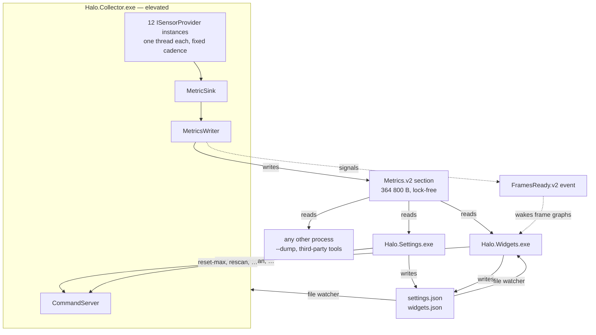

# Halo architecture

How the app is put together and why the pieces sit where they do. It describes Halo as it is
today; the byte-level contract between the pieces lives in
[metrics-protocol.md](metrics-protocol.md), and the catalogue of what is measured in
[current-metrics-inventory.md](current-metrics-inventory.md).

## Three processes

Halo is three executables that share one folder and talk through three named kernel objects — a
shared-memory section, an event and a pipe — plus two JSON files on disk.

| Process | Runs as | Job |
| --- | --- | --- |
| `Halo.Collector.exe` | elevated (a scheduled task at highest privileges) | reads every sensor, publishes to shared memory |
| `Halo.Widgets.exe` | the logged-in user, medium integrity | one window per widget, tray icon, collector watchdog |
| `Halo.Settings.exe` | the logged-in user, medium integrity | WPF config editor, System check, installer CLI verbs |

Two shared libraries sit underneath them:

- **`Halo.Metrics`** — the shared-memory layout, reader, writer and control-pipe client. It is
  dependency-free and AOT-compatible on purpose, so a third-party tool can drop the DLL in and
  read Halo's metrics without any of Halo's other code (`src/Halo.Metrics/Halo.Metrics.csproj`).
- **`Halo.Shared`** — paths, logging, config models and the panel catalogue. It references
  `Halo.Metrics`; the dependency never runs the other way.

### Why the boundary is there

Three reasons, in order of weight.

**Privilege.** Ring-0 sensor reads (CPU MSRs through PawnIO, SuperIO port I/O, SMART) and owning
an ETW session all need administrator rights. Splitting the collector out means exactly one
process needs them — nothing a user clicks on runs elevated. The shared section is created with
an explicit DACL granting `GENERIC_READ` to Everyone and a medium mandatory label, which is what
lets a medium-integrity widget read a high-integrity collector's memory
(`src/Halo.Metrics/NativeSection.cs:38`).

**Crash isolation.** Sensor libraries are the least trustworthy code in the app. A provider
exception is caught and that provider alone is re-initialised; a fault too hard to catch takes the
collector down and nothing else — the widgets keep rendering, mark their values stale and restart
the collector task. The reverse holds too: a widget that dies never touches data collection.

**Fan-out.** Metrics are published once and read by any number of consumers at their own cadence.
The widget process is just the first reader; the Settings app is the second, `--dump` is the
third, and anything else on the machine can be the fourth.

## Data flow

The section is `Local\Halo.Metrics.v2`, the event `Local\Halo.FramesReady.v2` and the command
server listens on `\\.\pipe\Halo.Control.v2`.

### Collecting

Each provider implements `ISensorProvider` — `Initialize`, `Poll`, a rate ceiling and a couple of
capability flags (`src/Halo.Collector/ISensorProvider.cs`). `ProviderHost` gives every one its own
background thread and runs it at a fixed cadence. A provider that fails to initialise is retried
with backoff (1 s, 5 s, 30 s, then every 60 s); ten consecutive poll failures send it back through
initialisation. One provider's exception never reaches another
(`src/Halo.Collector/ProviderHost.cs:236-359`).

The host also enforces the **freshness contract**: a value in shared memory is either fresh or
absent, never merely old. A separate watchdog thread marks a provider's metrics N/A once it has
gone `max(10 s, 10 × its own period)` without completing a poll
(`src/Halo.Collector/ProviderHost.cs:31-43`). Without it, a sensor that quietly stopped would keep
its last reading and a valid timestamp, and the widgets would render a dead sensor as a live one
indefinitely. The bound is deliberately generous, so a hiccup, an init retry or a `rescan` never
trips it.

The cadences are engineering constants, not user settings — they live in one file,
`src/Halo.Collector/CollectorRates.cs`, with the measurement that justifies each one. Nobody
outside the codebase can judge what a sensor class tolerates, and the host computes each period
once at start-up anyway.

| Provider | Cadence | Ceiling | Needs elevation |
| --- | --- | --- | --- |
| `builtin` — uptime, RAM, IPs, drive space | 1 Hz | 4 Hz | no |
| `cpu-kernel` — per-core and total load | 10 Hz | 64 Hz | no |
| `process` — top CPU / RAM lists | 1 Hz | 2 Hz | no |
| `disk-io` — per-volume read/write rates | 10 Hz | 64 Hz | no |
| `network` — interface throughput | 10 Hz | 64 Hz | no |
| `nvml` — NVIDIA GPU telemetry | 10 Hz | 20 Hz | no |
| `lhm-cpu` — package temp, power, Vcore | 5 Hz | 20 Hz | yes |
| `lhm-superio` — fan RPM, board voltages | 1 Hz | 2 Hz | yes |
| `lhm-storage` — SMART / NVMe temps | 0.1 Hz (every 10 s) | 0.2 Hz | yes |
| `lhm-gpu` — NVAPI extras, AMD and Intel cards | 1 Hz | 2 Hz | no |
| `presentmon` — frame data drain | 40 Hz | 120 Hz | yes |
| `pclstats` — Reflex PC latency markers | 5 Hz | 20 Hz | yes |

Every metric registers the cadence it *really* changes at, which is not always its provider's poll
rate: the 1% and 0.1% lows are recomputed at 2 Hz inside the 40 Hz PresentMon drain, and hardware
facts discovered once (names, counts, capabilities) register 0 Hz. A consumer reads that number and
knows when polling faster buys nothing.

### Publishing

`MetricsWriter` owns one shared-memory section, `Local\Halo.Metrics.v2`. It is a fixed 364 800-byte
layout: a header, a 32-row provider health table, a 1024-entry metric registry, a value block
index-parallel to the registry, 256 string slots and an 8192-entry frame ring. Nothing in it takes
a lock:

- **Values** are 8-byte doubles paired with a QPC timestamp, written value-first and stamped with a
  release store, so a reader can never observe a torn pair on x64. A zero timestamp means N/A.
- **Strings** use a seqlock — read the sequence number, copy, re-read, retry if it moved.
- **Frames** are appended and then published by bumping a monotonic cursor.
- The **provider table** is what Settings' System check reads to explain a panel full of N/A. No
  log parsing.

The collector refreshes a heartbeat in the header once a second. Readers treat it as stale after
5 s without one — and as actually gone only when the PID in the header has stopped existing too,
because a heartbeat can lag on a busy machine.

Full field-by-field layout, the enums and the five rules a reader must follow:
[metrics-protocol.md](metrics-protocol.md).

### Reading

The widget process repaints on a per-widget clock between 0.5 Hz and 10 Hz. The ceiling is not a
constant — `PanelRates.MaxHz` reads the live registry and bounds each widget by the fastest metric
it actually shows, so the settings slider can never promise freshness the collector does not
produce (`src/Halo.Shared/Panels/PanelRates.cs`).

Frame graphs are the exception, because a 10 Hz tick would throw most of a 240 fps trace away. The
collector signals `Local\Halo.FramesReady.v2` whenever it appends frames; the widget loop waits on
that event alongside its timers and pulls frame-graph widgets' next tick forward, coalesced to
16 ms so a busy title cannot repaint faster than a 60 Hz panel can show
(`src/Halo.Widgets/App.cs:267-284`). If the event does not exist — an older collector, or one that
has not started yet — the graphs simply stay timer-driven.

### Commanding

`\\.\pipe\Halo.Control.v2` is one-way, newline-delimited UTF-8, fire and forget: write a line,
close the handle. It carries the five actions that cannot be expressed as config — `reset-max`,
`reset-net`, `rescan`, `reload-config` and `ping`. Unknown lines are logged and ignored, so adding
a command breaks nothing.

`rescan` re-runs `Initialize` on every provider that enumerates hardware, on that provider's own
thread, so a GPU, fan channel or volume that appeared since start-up gets registered without a
restart. Providers that own an ETW session or a counter baseline opt out — tearing those down to
look for a new fan would lose frame data or reset session totals. So does `lhm-cpu`, for the dull
reason: four fixed metrics, no indexed family, and a CPU that cannot be hot-plugged, so re-opening
it is pure cost. Repeats inside 10 s are dropped, so a held-down button cannot become a re-open
storm.

The four LibreHardwareMonitor parts run four `Computer` instances on four threads, and LHM 0.9.6's
`OpCode` plumbing — the page holding its hand-written rdtsc/cpuid stubs — is process-global and not
reference counted. Any part's `Close()` therefore tears it out from under the others. `LhmProvider`
gates every LHM call behind one static reader/writer lock (write = open/close, read = `Update()`)
**and** never leaves a `Close()` unpaired, so no part exits the gate with LHM's globals shut. Both
rules are load-bearing; the gate alone was measured insufficient
(`src/Halo.Collector/Providers/LhmProvider.cs:22-52`).

## Rendering

Each widget is one `WS_EX_NOREDIRECTIONBITMAP` popup window with a DirectComposition visual,
drawn with Direct2D. All windows share a single D3D11 device, D2D device, DComp device and
DirectWrite factory (`src/Halo.Widgets/Dx.cs`), recreated wholesale on device loss.

A panel is an element tree — text rows, bars, graphs — laid out in a Rainmeter-like vertical flow
(`src/Halo.Widgets/Render/Panel.cs`). Redraw is dirty-driven: a tick that changes no displayed
value costs layout comparisons and no drawing at all. Coordinates are logical units scaled once in
the renderer, so a DPI change is a re-layout rather than a bitmap stretch.

What each panel type shows, which options it takes and which theme tokens it paints with is
declared once in `src/Halo.Shared/Panels/PanelCatalog.cs:100-328`. The renderer builds panels from
it and the Settings app generates its controls from it, so adding a metric or an option is one
edit rather than three.

Window behaviour — drag, 8 px snapping to screen and widget edges, z-order modes, click-through,
per-widget opacity, the context menu — lives in `WidgetWindow`. Desktop parenting (finding
Progman or the wallpaper `WorkerW`), the tray icon and the collector watchdog live in `App`.

## Frame data has two lanes

Frame timing is measured twice, on purpose, because the two questions have different answers.

| Lane | Source | Answers |
| --- | --- | --- |
| **Resolved** | bundled Intel PresentMon 2 service, spawned as a console-mode child process and driven through `PresentMonAPI2.dll` | what the display actually showed — displayed FPS, frame-gen ratio, lows, latency |
| **Tap** | Halo's own ETW session on DXGI and D3D9 present-start events | what the app submitted, with no wait for each frame's fate — presented FPS, live frametime |

The resolved lane knows whether a frame was displayed, dropped or generated, but only after the
fact. The tap lane knows a present happened the moment it happens, and never revises it; its ring
entries are flagged provisional so a consumer never mixes the two timelines in one graph. Vulkan
and OpenGL titles are invisible to the tap, and fall back to the resolved lane.

The pipeline is idle-aware: 10 s without frames relaxes the service's ETW flush period and mutes
the tap; frames re-arm it within about 150 ms. The PresentMon service is never registered with the
Windows service manager, so it leaves no service entry behind.

## Configuration

Two JSON files, both hot-reloaded:

| File | Holds |
| --- | --- |
| `settings.json` | global appearance defaults, snap and lock, collector knobs |
| `widgets.json` | one entry per widget — type, monitor, position, z-mode, refresh rate, and per-widget metric / option / appearance overrides |

They live in `%LOCALAPPDATA%\Halo\config\`, or in `<app folder>\data\config\` when a file named
`portable.marker` sits next to the exes. If neither is writable, everything falls back to
`%TEMP%\Halo` and says so loudly in the log (`src/Halo.Shared/Paths.cs`). A reference copy of the
schema — which Halo never reads — is checked in at `config/reference/`.

Both are written by more than one process: Settings roughly every 200 ms while a user drags a
slider, the widget process on drag-end and on a context-menu toggle. So a save is never a
whole-file dump of a stale in-memory copy. `ConfigStore` takes a named cross-process mutex
(`Local\Halo.Config.<key>.<file>`, 5 s timeout), re-reads the file, applies just the fields the
caller touched, and writes it back through a per-process-unique temp file and an atomic
`File.Move`. Without the lock two read-modify-write cycles interleave and one process's change
disappears — which is what "Halo forgot where I put that widget" was
(`src/Halo.Shared/Config/ConfigStore.cs:178-250`).

A `FileSystemWatcher` debounced to ~200 ms picks up every change, including hand edits, in both the
collector and the widget process. A file that is present but does not parse is *not* treated as
absent: the last good copy is kept, the reason is logged, and writes to that file are refused
rather than clobbering whatever is being hand-edited (`ConfigStore.cs:139-155`).

## Lifecycle

**Startup order does not matter.** The widget process attaches to the section if it exists and
shows idle panels if it does not, then rebuilds its widgets from discovered hardware the moment
the collector appears. The collector does not care whether anyone is reading.

**Two ways in.** *Autostart* is two scheduled tasks — `\Halo\Collector` at highest privileges and
`\Halo\Widgets` at normal, both triggered at logon, both registered through the Task Scheduler API
by `Halo.Settings.exe --register-autostart`. *By hand* is the `Halo` shortcut, which runs
`Halo.Widgets.exe --start-collector`: the overlay comes up, and `CollectorLauncher` starts the
collector through the `runas` verb — one ordinary UAC prompt. The elevation lives there rather than
in the collector's manifest on purpose: `requireAdministrator` would make it unconditional,
including for `--dump`, `--migrate-config` and the smoketests, and would delete the "degrades
gracefully unelevated" property the collector is built around
(`src/Halo.Widgets/CollectorLauncher.cs`). See [install-footprint.md](install-footprint.md).

**Watchdog.** The widget process treats the collector as stale after 5 s without a heartbeat and
asks the scheduled task to start it, backing off 1 s, 5 s, then 30 s
(`src/Halo.Widgets/App.cs:550-606`). Two refinements are worth knowing:

- **No task is a normal state**, not an error, now that Halo can be started from a shortcut — so
  the watchdog leaves the stale badges up and logs one line rather than raising a UAC dialog on an
  idle desktop. It re-probes for the task every 60 s, because autostart can be switched on at any
  time from System check.
- **A wedged collector is ended before it is restarted.** The task uses Task Scheduler's default
  `IGNORE_NEW`, which is right — two collectors fight over the same section and the same ETW
  session — but it also means `/Run` against an instance hung inside native sensor code is silently
  a no-op. So the watchdog issues `/End` first, and only when the pid is actually still there.

**Explorer restarts** destroy the desktop host window and every widget parented to it. A guard
re-validates the host every 2 s and rebuilds the windows onto whatever host exists then — even if
the shell is not back yet, in which case they render unparented at the bottom of the z-order until
it is (`src/Halo.Widgets/App.cs:423-456`).

**Display changes.** Desktop-parented children do not reliably receive `WM_DISPLAYCHANGE` or
`WM_DPICHANGED`, so a position guard re-derives each widget's expected rect from config every 5 s
and re-pins on drift. Widgets whose monitor is missing are column-packed onto the primary one,
in memory only, so unplugging a display never rewrites a saved layout.

## Where to start reading

| Want to… | Start at |
| --- | --- |
| add a sensor | `src/Halo.Collector/ISensorProvider.cs`, then a neighbour in `Providers/` |
| add a metric to a panel | `src/Halo.Shared/Panels/PanelCatalog.cs` |
| add a panel type | `PanelCatalog.cs`, then `src/Halo.Widgets/PanelDefs/` |
| read Halo's data from another app | [metrics-protocol.md](metrics-protocol.md), `src/Halo.Metrics` |
| change a poll rate | `src/Halo.Collector/CollectorRates.cs` |
| understand a number on screen | [current-metrics-inventory.md](current-metrics-inventory.md) |
| know what installing puts on a machine | [install-footprint.md](install-footprint.md) |
| check nothing broke | `tests/Halo.Tests` — frame stats, section layout, provider freshness |
