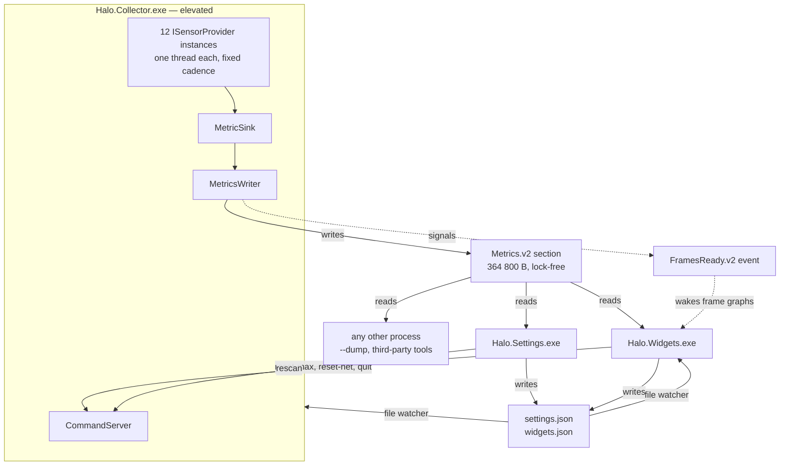

# Halo architecture

How Halo is put together, and why each piece sits where it does. This page describes Halo as it
is today. The byte-level contract between the pieces is in [metrics-protocol.md](metrics-protocol.md),
and the catalogue of what is measured is in [current-metrics-inventory.md](current-metrics-inventory.md).

## Three processes

Halo is three programs that share one folder. They talk through three named kernel objects — a
shared-memory section, an event and a pipe — and two JSON files on disk.

| Process | Runs as | Job |
| --- | --- | --- |
| `Halo.Collector.exe` | Elevated (a scheduled task at highest privileges, or a UAC prompt from the `Halo` shortcut) | Reads every sensor and publishes the values to shared memory |
| `Halo.Widgets.exe` | The signed-in user, medium integrity | One window per widget, the notification-area icon, and the collector watchdog |
| `Halo.Settings.exe` | The signed-in user, medium integrity | The settings editor, System check, and the command-line verbs the installer calls |

Two shared libraries sit underneath them:

- **`Halo.Metrics`** — The shared-memory layout, reader, writer and control-pipe client. It has no
  dependencies and is AOT-compatible on purpose, so a third-party tool can add the DLL and read
  Halo's metrics without any of Halo's other code (`src/Halo.Metrics/Halo.Metrics.csproj`).
- **`Halo.Shared`** — Paths, logging, settings models and the panel catalogue. It references
  `Halo.Metrics`; the dependency never runs the other way.

### Why the split is there

There are three reasons, in order of importance.

**Privilege.** Low-level sensor reads (CPU MSRs through PawnIO, SuperIO port I/O, SMART) and owning
an ETW session all need administrator rights. With the collector in its own process, exactly one
process needs them, and nothing a user clicks on runs elevated. The shared section is created with
an explicit DACL that grants `GENERIC_READ` to Everyone together with a medium mandatory label,
which is what allows a medium-integrity widget to read a high-integrity collector's memory
(`src/Halo.Metrics/NativeSection.cs`).

**Crash isolation.** Sensor libraries are the least predictable code in the app. A provider
exception is caught and only that provider is initialised again. A fault that cannot be caught
takes down the collector and nothing else: the widgets keep drawing, mark their values stale and
restart the collector. The reverse also holds — a widget that fails never affects data collection.

**Many readers.** Metrics are published once and read by any number of programs, each at its own
pace. The widget process is the first reader, the Settings app the second, `--dump` the third, and
any other program on the machine can be the fourth.

## Data flow

The section is `Local\Halo.Metrics.v2`, the event is `Local\Halo.FramesReady.v2`, and the command
server listens on `\\.\pipe\Halo.Control.v2`.

### Collecting

Each provider implements `ISensorProvider`: `Initialize`, `Poll`, a rate ceiling and a few
capability flags (`src/Halo.Collector/ISensorProvider.cs`). `ProviderHost` gives each one its own
background thread and runs it at a fixed cadence. A provider that fails to initialise is retried
after 1 s, 5 s, 30 s and then every 60 s, and ten poll failures in a row send it back through
initialisation. One provider's exception never reaches another (`src/Halo.Collector/ProviderHost.cs`).

The host also keeps the **freshness contract**: a value in shared memory is either fresh or absent,
never just old. A separate watchdog thread marks a provider's metrics N/A once it has gone
`max(10 s, 10 × its own period)` without finishing a poll. Without it, a sensor that quietly stopped
would keep its last reading and a valid timestamp, and the widgets would show a dead sensor as a
live one indefinitely. The limit is deliberately generous, so a short delay, an init retry or a
`rescan` never trips it.

The cadences are engineering constants, not user settings. They live in one file,
`src/Halo.Collector/CollectorRates.cs`, next to the measurement behind each one. Only the code can
judge what a sensor tolerates, and the host computes each period once at start-up anyway.

| Provider | Cadence | Ceiling | Needs elevation |
| --- | --- | --- | --- |
| `builtin` — uptime, RAM, IPs, drive space | 1 Hz | 4 Hz | No |
| `cpu-kernel` — per-core and total load | 10 Hz | 64 Hz | No |
| `process` — top CPU and RAM lists | 1 Hz | 2 Hz | No |
| `disk-io` — per-volume read and write rates | 10 Hz | 64 Hz | No |
| `network` — interface throughput | 10 Hz | 64 Hz | No |
| `nvml` — NVIDIA GPU telemetry | 10 Hz | 20 Hz | No |
| `lhm-cpu` — package temperature, power, Vcore | 5 Hz | 20 Hz | Yes |
| `lhm-superio` — fan speeds, board voltages | 1 Hz | 2 Hz | Yes |
| `lhm-storage` — SMART and NVMe temperatures | 0.1 Hz (every 10 s) | 0.2 Hz | Yes |
| `lhm-gpu` — NVAPI extras, AMD and Intel cards | 1 Hz | 2 Hz | No |
| `presentmon` — frame data | 40 Hz | 120 Hz | Yes |
| `pclstats` — Reflex PC latency markers | 5 Hz | 20 Hz | Yes |

Every metric registers the cadence it *actually* changes at, which is not always its provider's
poll rate. The 1% and 0.1% lows are recalculated at 2 Hz inside the 40 Hz PresentMon poll, and
facts discovered once (names, counts, capabilities) register 0 Hz. A reader can use that number to
know when polling faster gains nothing.

### Publishing

`MetricsWriter` owns one shared-memory section, `Local\Halo.Metrics.v2`. It has a fixed
364 800-byte layout: a header, a 32-row provider health table, a 1024-entry metric registry, a value
block that lines up entry-for-entry with the registry, 256 string slots and an 8192-entry frame
ring. Nothing in it takes a lock:

- **Values** are 8-byte doubles paired with a QPC timestamp. The value is written first and the
  timestamp second with a release store, so a reader can never see a half-written pair on x64. A
  zero timestamp means N/A.
- **Strings** use a seqlock: read the sequence number, copy, read it again, and retry if it changed.
- **Frames** are appended and then published by advancing a counter that only ever goes up.
- The **provider table** is what System check reads to explain a widget full of N/A, with no log
  parsing.

The collector refreshes a heartbeat in the header once a second. Readers treat it as stale after
5 s without one, and as actually gone only when the process ID in the header no longer exists
either, because a heartbeat can fall behind on a busy machine.

The full field-by-field layout, the enums and the five rules a reader follows are in
[metrics-protocol.md](metrics-protocol.md).

### Reading

The widget process redraws each widget on its own clock, between 0.5 Hz and 10 Hz. The upper limit
is not fixed: `PanelRates.MaxHz` reads the live registry and limits each widget to the fastest
metric it actually shows, so the Settings slider can never offer more freshness than the collector
produces (`src/Halo.Shared/Panels/PanelRates.cs`).

Frame graphs are the exception, because a 10 Hz tick would drop most of a 240 fps trace. The
collector signals `Local\Halo.FramesReady.v2` whenever it adds frames. The widget loop waits on
that event alongside its timers and brings the frame-graph widgets' next tick forward, at most once
every 16 ms, so a busy game cannot make them redraw faster than a 60 Hz monitor can show
(`App.OnFramesReady` in `src/Halo.Widgets/App.cs`). If the event does not exist — an older
collector, or one that has not started yet — the graphs simply stay on their timers.

### Commands

`\\.\pipe\Halo.Control.v2` is one-way, newline-separated UTF-8, with no reply: a client writes a
line and closes the handle. It carries the actions that cannot be expressed as settings —
`reset-max`, `reset-net`, `rescan`, `reload-config`, `ping` and `quit`. Unknown lines are logged
and ignored, so adding a command breaks nothing. `quit` is the only way to stop the collector that
runs its shutdown path; the tray's **Exit Halo** sends it.

`rescan` runs `Initialize` again on every provider that enumerates hardware, on that provider's own
thread, so a GPU, fan channel or volume that appeared since start-up is registered without a
restart. Providers that own an ETW session or a counter baseline skip it, because tearing those
down to look for a new fan would lose frame data or reset the session totals. `lhm-cpu` skips it
too, simply because it has nothing to find: four fixed metrics, no indexed family, and a CPU that
cannot be added while the machine runs. A second `rescan` within 10 s is ignored, so a button held
down cannot cause a burst of re-opens.

The four LibreHardwareMonitor parts run four `Computer` instances on four threads, and
LibreHardwareMonitor 0.9.6's `OpCode` code — the memory page that holds its hand-written rdtsc and
cpuid stubs — is shared by the whole process and not reference counted. Any part's `Close()`
therefore removes it from under the others. `LhmProvider` puts every LibreHardwareMonitor call
behind one static reader/writer lock (write for open and close, read for `Update()`) **and** never
leaves a `Close()` without a matching `Open()`, so no part leaves the lock with those shared
resources closed. Both rules are needed; the lock on its own was measured and found not to be enough
(`src/Halo.Collector/Providers/LhmProvider.cs`).

## Rendering

Each widget is one `WS_EX_NOREDIRECTIONBITMAP` popup window with a DirectComposition visual, drawn
with Direct2D. All windows share a single D3D11 device, D2D device, DirectComposition device and
DirectWrite factory (`src/Halo.Widgets/Dx.cs`), which are recreated together if the device is lost.

A panel is a tree of elements — text rows, bars and graphs — laid out in a Rainmeter-style vertical
flow (`src/Halo.Widgets/Render/Panel.cs`). Redrawing is driven by changes: a tick that changes no
displayed value costs a comparison and no drawing at all. Coordinates are logical units scaled once
in the renderer, so a DPI change means a new layout rather than a stretched bitmap.

What each panel type shows, which options it takes and which theme colours it uses is declared once
in `src/Halo.Shared/Panels/PanelCatalog.cs`. The renderer builds panels from it and the Settings app
generates its controls from it, so adding a metric or an option is one edit rather than three.

Window behaviour — dragging, 8 px snapping to screen and widget edges, z-order modes, click-through,
per-widget opacity and the context menu — lives in `WidgetWindow`. Attaching to the desktop (finding
Progman or the wallpaper `WorkerW` window), the notification-area icon and the collector watchdog
live in `App`.

## Frame data has two lanes

Frame timing is measured twice, on purpose, because the two questions have different answers.

| Lane | Source | Answers |
| --- | --- | --- |
| **Resolved** | The bundled Intel PresentMon 2 service, started as a console-mode child process and driven through `PresentMonAPI2.dll` | What the display actually showed — displayed FPS, frame generation ratio, lows, latency |
| **Tap** | Halo's own ETW session on the DXGI and D3D9 present-start events | What the app submitted, without waiting to learn each frame's outcome — presented FPS, live frametime |

The resolved lane knows whether a frame was displayed, dropped or generated, but only afterwards.
The tap lane knows a present happened the moment it happens, and never changes that answer. Its
ring entries are marked provisional so a reader never mixes the two timelines in one graph. Vulkan
and OpenGL games are invisible to the tap and use the resolved lane instead.

The pipeline adjusts when nothing is running: after 10 s without frames it relaxes the service's
ETW flush period and mutes the tap, and new frames wake it again within about 150 ms. The PresentMon
service is never registered with the Windows service manager, so it leaves no service entry behind.

## Configuration

There are two JSON files, and both are reloaded as soon as they change:

| File | Holds |
| --- | --- |
| `settings.json` | Global appearance defaults, snapping and locking, collector options, log level |
| `widgets.json` | One entry per widget — type, monitor, position, z-order, refresh rate, and per-widget metric, option and appearance overrides |

They live in `%LOCALAPPDATA%\Halo\config\`, or in `<app folder>\data\config\` when a file named
`portable.marker` sits next to the programs. If neither location is writable, everything falls back
to `%TEMP%\Halo` and the log says so clearly (`src/Halo.Shared/Paths.cs`). An example of the schema,
which Halo never reads, is in `config/reference/`.

Both files are written by more than one process: Settings roughly every 200 ms while a slider is
being dragged, and the widget process when a drag ends or a context-menu option changes. So a save
is never a whole-file copy of an out-of-date version in memory. `ConfigStore` takes a named
cross-process mutex (`Local\Halo.Config.<key>.<file>`, 5 s timeout), reads the file again, applies
only the fields the caller changed, and writes it back through a temporary file unique to that
process followed by an atomic `File.Move`. Without the lock, two read-modify-write cycles overlap and
one process's change disappears — which is what "Halo forgot where I put that widget" turned out
to be (`src/Halo.Shared/Config/ConfigStore.cs`).

A `FileSystemWatcher`, delayed by about 200 ms to group bursts of changes, picks up every change,
including hand edits, in both the collector and the widget process. A file that exists but does not
parse is *not* treated as missing: the last good copy is kept, the reason is logged, and writes to
that file are refused so a hand edit in progress is never overwritten.

## Logging and session records

Every process instance writes its own log file, `logs\<process>-<yyyyMMdd-HHmmss>-<pid>.log`, under
the data folder (`src/Halo.Shared/Log.cs`). A shared daily file could not cope with more than one
writer, and several collectors once mixed their lines into one file with no way to tell them apart.
Each record carries a timestamp with its UTC offset, a level, a session ID and a component name,
and a multi-line stack trace repeats that prefix on every line.

Most records go through a background queue. `Log.Durable` writes synchronously instead, for records
that must survive whatever happens next — crash handlers, and markers around native calls that
could end the process. Log files rotate, old ones are removed after seven days (three in the portable
copy), and the folder has a size limit. The level comes from `settings.json` (`diagnostics.logLevel`, the **Verbose logging**
switch in System check), and the `HALO_LOG_LEVEL` environment variable overrides it, which helps
when the settings file itself will not parse.

`SessionLog` answers a different question: why a process is no longer running. Each instance keeps
a small record in `logs\sessions\` and updates its current phase as it goes, so a native crash or a
hard kill still leaves the last phase behind. On the next start, earlier records are classified as
clean, expected (stopped on purpose by something else, such as the watchdog or an upgrade),
unclean, or unknown. A record is matched by process ID **and** the operating system's process start
time, because Windows reuses process IDs; when Halo cannot check, the answer is unknown rather than
a guessed crash (`src/Halo.Shared/SessionLog.cs`).

## Lifecycle

**Start-up order does not matter.** The widget process attaches to the section if it exists and
shows idle panels if it does not, then rebuilds its widgets from the discovered hardware as soon as
the collector appears. The collector does not care whether anything is reading.

**Two ways to start.** *Autostart* is two scheduled tasks — `\Halo\Collector` at highest privileges
and `\Halo\Widgets` at normal privileges — both triggered at sign-in and both registered through the
Task Scheduler API by `Halo.Settings.exe --register-autostart`. *By hand* is the `Halo` shortcut,
which runs `Halo.Widgets.exe --start-collector`: the widgets appear, and `CollectorLauncher` starts
the collector through the `runas` verb, with one ordinary UAC prompt. The elevation request lives
there rather than in the collector's manifest on purpose. `requireAdministrator` would make it
unconditional, including for `--dump`, `--migrate-config` and the smoketests, and would remove the
collector's ability to run with reduced sensors when it is not elevated
(`src/Halo.Widgets/CollectorLauncher.cs`). See [install-footprint.md](install-footprint.md).

**Watchdog.** The widget process treats the collector as stale after 5 s without a heartbeat and
asks the scheduled task to start it, waiting 1 s, 5 s and then 30 s between attempts
(`App.Watchdog` in `src/Halo.Widgets/App.cs`). Two details are worth knowing:

- **No task is a normal state**, not an error, because Halo can be started from a shortcut. The
  watchdog leaves the stale markers up and logs one line rather than showing a UAC dialog on an idle
  desktop. It checks for the task again every 60 s, because autostart can be turned on at any time
  from System check.
- **A stuck collector is ended before it is restarted.** The task uses Task Scheduler's default
  `IGNORE_NEW`, which is right, because two collectors would compete for the same section and the
  same ETW session. But it also means `/Run` does nothing while an instance is stuck inside native
  sensor code. So the watchdog records the stop with `SessionLog.RecordExternalStop`, issues `/End`
  first, and only does so when that process ID is actually still there.

**Explorer restarts** destroy the desktop window and every widget attached to it. A guard checks
the desktop window every 2 s and rebuilds the widgets on whatever desktop window exists at that
point. If the shell is not back yet, they appear unattached at the bottom of the z-order until it is
(`App.HostGuard` in `src/Halo.Widgets/App.cs`).

**Display changes.** Windows attached to the desktop do not reliably receive `WM_DISPLAYCHANGE` or
`WM_DPICHANGED`, so a position guard works out each widget's expected position from the settings
every 5 s and moves it back if it has drifted. Widgets whose monitor is missing are stacked in
columns on the primary monitor, in memory only, so unplugging a display never changes a saved
layout.

## Where to start reading

| To… | Start at |
| --- | --- |
| Add a sensor | `src/Halo.Collector/ISensorProvider.cs`, then a neighbour in `Providers/` |
| Add a metric to a panel | `src/Halo.Shared/Panels/PanelCatalog.cs` |
| Add a panel type | `PanelCatalog.cs`, then `src/Halo.Widgets/PanelDefs/` |
| Read Halo's data from another app | [metrics-protocol.md](metrics-protocol.md), `src/Halo.Metrics` |
| Change a poll rate | `src/Halo.Collector/CollectorRates.cs` |
| Understand a number on screen | [current-metrics-inventory.md](current-metrics-inventory.md) |
| Know what installing puts on a machine | [install-footprint.md](install-footprint.md) |
| Check nothing broke | `dotnet test Halo.sln` — `tests/Halo.Tests` covers frame statistics, the section layout, provider freshness, settings loading and saving, and the logger |
